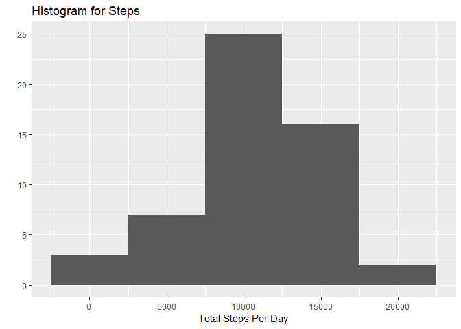
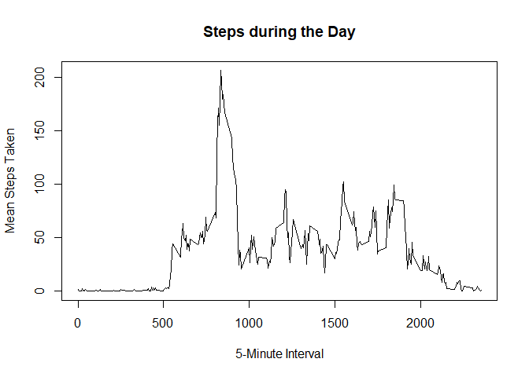
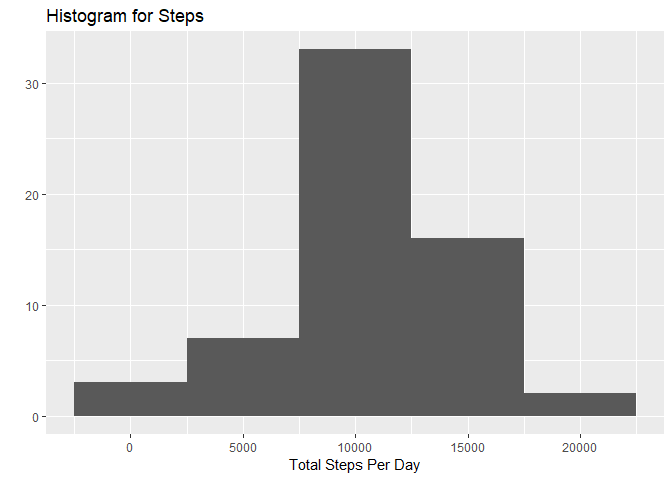

Reproducible Research
=====================

Loading packages :

      library("dplyr")

    ## 
    ## Attaching package: 'dplyr'

    ## The following objects are masked from 'package:stats':
    ## 
    ##     filter, lag

    ## The following objects are masked from 'package:base':
    ## 
    ##     intersect, setdiff, setequal, union

      library("lubridate")

    ## 
    ## Attaching package: 'lubridate'

    ## The following object is masked from 'package:base':
    ## 
    ##     date

      library("data.table")

    ## 
    ## Attaching package: 'data.table'

    ## The following objects are masked from 'package:lubridate':
    ## 
    ##     hour, isoweek, mday, minute, month, quarter, second, wday,
    ##     week, yday, year

    ## The following objects are masked from 'package:dplyr':
    ## 
    ##     between, first, last

      library("tibble")
      library("ggplot2")
      library("lattice")

1.  reading the data file using fread and tbl\_df, also cleaning up the
    date column simultaneously using mutate

<!-- -->

        rawdata<- tbl_df(fread("activity.csv", na.strings = "NA") ) %>%  mutate(date = ymd(date))

1.  filtering out NA values

<!-- -->

        data <- filter(rawdata, steps != 'NA')

1.  aggregating data to get total steps each day

<!-- -->

      aggregated_totalsteps <- aggregate(x =data[c("steps","interval")], by = list(data$date),FUN = sum)

1.  creating histogram of total steps per day using qplot

<!-- -->

    qplot(aggregated_totalsteps$steps, geom="histogram",binwidth= 5000, main = "Histogram for Steps", xlab = "Total Steps Per Day")

1.  mean steps

<!-- -->

    Meansteps <- mean(aggregated_totalsteps$steps)

1.  median steps

<!-- -->

    Mediansteps <- median(aggregated_totalsteps$steps)

What is the average daily activity pattern?
-------------------------------------------

1.  aggregrating data by interval for time series plot

<!-- -->

    Byinterval <- aggregate(data$steps, by = list(data$interval), mean)
    colnames(Byinterval)<-c("intervalID", "Mean steps")

1.  Time Series plot

<!-- -->

    plot(Byinterval$intervalID,Byinterval$`Mean steps`,type="l",xlab="5-Minute Interval",ylab="Mean Steps Taken",
         
         main="Steps during the Day")

1.  Interval with most activity

<!-- -->

    Byinterval$intervalID[which.max(Byinterval$`Mean steps`)]

    ## [1] 835

Imputing missing values
-----------------------

1.  Let us re-read the raw data

<!-- -->

    data2<- tbl_df(fread("activity.csv", na.strings = "NA") ) %>%  mutate(date = ymd(date))

1.  How many missing values

<!-- -->

    sum(!complete.cases(data2))

    ## [1] 2304

1.  Replacing missing values with mean from that specific interval (Ex:
    Missing value in interval 5 replaced by mean step value in interval
    5

<!-- -->

    summary <- data2[complete.cases(data2), ] %>% group_by(interval) %>% summarise(mean=mean(steps));
    incomplete <- data2[!complete.cases(data2),];
    updated <- merge(x=incomplete, y=summary, by="interval", all.x=T);
    updated$steps <- updated$mean;
    imputed <- rbind(data2[complete.cases(data2), ], select(updated, steps, date, interval))

1.  no more NA values

<!-- -->

    sum(!complete.cases(imputed))

    ## [1] 0

1.  aggregating data2 to get total steps each day

<!-- -->

    aggregated_totalsteps2 <- aggregate(x =imputed[c("steps","interval")], by = list(imputed$date),FUN = sum)

1.  creating the new histogram of total steps per day using qplot

<!-- -->

    qplot(aggregated_totalsteps2$steps, geom="histogram",binwidth= 5000, main = "Histogram for Steps", xlab = "Total Steps Per Day")

1.  new mean steps

<!-- -->

    Meansteps2 <- mean(aggregated_totalsteps2$steps)

1.  median steps

<!-- -->

    Mediansteps2 <- median(aggregated_totalsteps2$steps)

Are there differences in activity patterns between weekdays and weekends?
-------------------------------------------------------------------------

1.  Creating a new column that classifies date column into
    weekend/weekday

<!-- -->

    imputed$day<-ifelse(as.POSIXlt(as.Date(imputed$date))$wday%%6==0,
                             "weekend","weekday")

    imputed$day<-factor(imputed$day,levels=c("weekday","weekend"))

1.  Creating a subset data contains steps per interval, then creating a
    two panel chart

<!-- -->

    WeekdayWeekEndData <- aggregate(steps~interval+day,imputed,mean)
    xyplot(steps~interval|factor(day), data=WeekdayWeekEndData,aspect=1/2, type="l")

The plots show that there is difference in movement activity between
weekdays and weekends
